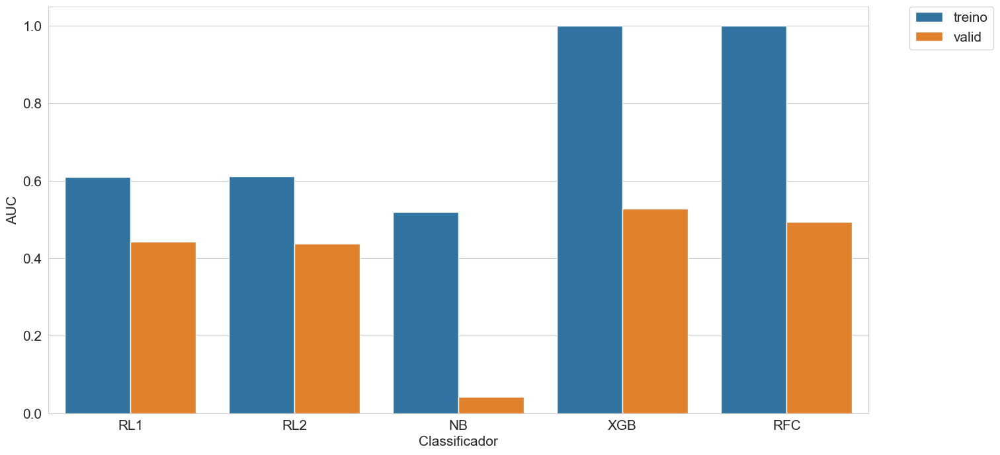

# Insurance_ML
Case Predictive Model for Insurance with Machine Learning.

#### Models Classifier:
* Logistic Regression
* Naive Bayes
* XGBoosting
* Random Foresting

#### Metrics:
* AUC
  

#### Parameter Optimization and Cross Validation:
* GridSearch

Results:

  
