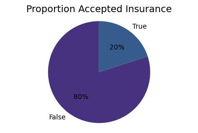

# Insurance_ML
Case Predictive Model for Insurance with Machine Learning.

#### Objective: prediction of insurance renewal.
#### Dataset: anonymized data.

#### Pre-processing:
* StandScaler

#### Models Classifier:
* Logistic Regression
* Naive Bayes
* XGBoosting
* Random Foresting

#### Metrics:
* AUC
  

#### Parameter Optimization and Cross Validation:
* GridSearch

Results:

  

Choice: Model chosen 'Random Forest without hyperparameters due to complexity and training being simpler and similar performance with hyperparameters.

#### Random Forest: 

